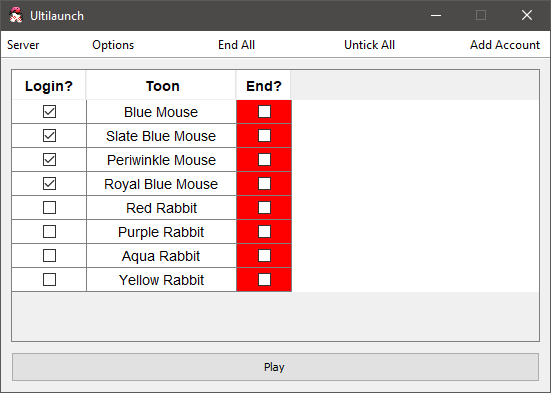

## Ultilaunch for Toontown Servers

This is a project aimed to allow users to launch their accounts for primarily [sunrise games
toontown servers](https://sunrise.games/).

It is inspired purely off [Tunetoon launcher](https://github.com/DioExtreme/Tunetoon) which
is for TTR and Clash.

This was done in Java as a challenge. The hardest part was by far getting native events to work.

Although it was done in Java, there are definitely things that will not work in Linux.
Compatibility will be worked on one day.

Shortcuts:
* ALT + LEFT CLICK - Swap two windows with this
* ALT + R - Reset windows back to original position
* ALT + S - Snap windows back to most recent adjusted position including swaps

Connects with multicontroller v2025.11.0 onwards and swaps follow. Behaviour is configurable
and optional.

## Development

Requires **Java 25** which you can grab from [here](https://adoptium.net/en-GB/temurin/releases).
You will also need maven version `3.9.1`. Make sure your maven is using the Java 25 installation.

This code uses spotless to format code. The build will fail if spotless checks fail. You can run
`mvn spotless:apply` to format all files.

## Building

Run [`jlink.ps1`](jlink.ps1) ensuring the `jlink` is run from your Java 25.
It will bundle your Java 25 into the runtime folder so you can just distribute it.

After this run [`bundle.ps1`](bundle.ps1). This will generate a zip file containing a few things:

A`runtime` folder which is a reduced version of your JDK to be bundled with the jar.
This was done mainly for distributing it easier and was produced when you ran `jlink` above.
* A [`launch.bat`](launch.bat) file. This is to start the launcher.
* `sunrise-launcher-jp.jar` which will be the main jar file that the batch script above runs

